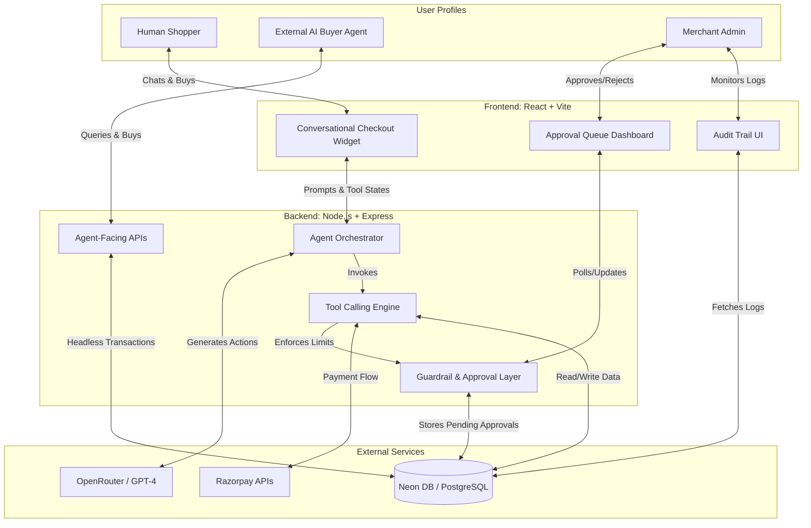

# Agentic Commerce Concierge

**Razorpay /buildathon — Track 01: AI Growth & Agentic Commerce**

Live Demo: [https://razorpay-x1fz.onrender.com](https://razorpay-x1fz.onrender.com)

An AI sales agent that sits on a merchant's storefront, grows revenue by having a real (conversational) sales conversation with human shoppers, and simultaneously exposes an agent-readable interface so AI shopping agents can discover, evaluate, and buy from the same merchant — all on Razorpay test-mode APIs, with every money action explainable, bounded, and gated.

---

## Complete Project Architecture

The project is structured as a full-stack web application designed with a unique "dual-door" philosophy: one door for human shoppers (visual UI) and one door for external AI buyer agents (structured API).

### Architecture Diagram

### 1. Frontend (React + Vite)
The frontend serves two primary audiences: the end-customer and the merchant administrator.
- **Conversational Checkout Widget**: A floating chat interface embedded directly on the storefront. Instead of a static catalog, the human shopper chats with the AI. The widget renders interactive UI components (like product cards and checkout buttons) directly inside the chat stream when the AI triggers them.
- **Admin Dashboards**:
  - **Approval Queue**: A critical safety UI for merchants. Whenever the AI attempts a transaction or discount that breaches predefined thresholds, it lands here for manual human review (Approve/Reject).
  - **Audit Trail**: A detailed timeline UI. Because AI can be unpredictable, this dashboard exposes *why* the AI made a decision, showing the exact tool calls, reasoning snippets, and outcomes for complete transparency.

### 2. Backend (Node.js + Express)
The backend acts as the orchestrator and the ultimate source of truth, ensuring the AI cannot execute rogue financial actions.
- **Agent Orchestrator**: The core brain. It maintains conversational memory, routes user intent to the LLM (via OpenRouter), and processes the LLM's function-calling requests.
- **Tool Calling Engine**: The AI is strictly limited to 5 specific tools to interact with the world:
  - `search_catalog`: Read-only product discovery.
  - `suggest_upsell`: Bundle proposition (limited to Max N per session).
  - `apply_discount`: Price modification (subject to hard caps).
  - `create_order`: Initiates Razorpay checkout (capped by `MAX_TRANSACTION_VALUE`).
  - `capture_payment`: Finalizes the transaction.
- **Guardrail Layer ("The Bar")**: The most important architectural component. It sits between the AI's intent and actual execution. If the AI hallucinates or tries to grant an 80% discount, the Guardrail Layer intercepts the tool call, prevents execution, and routes the request to the manual Approval Queue.
- **Agent-Facing APIs (`/api/catalog`, `/api/agent-order`)**: A headless, structured JSON interface designed explicitly for *external AI buyer agents* (like ACP/AP2 protocols). It allows external machines to discover products, evaluate pricing, and execute purchases programmatically using the exact same backend logic and guardrails as human shoppers.

### 3. Data & Payments
- **Database (Neon DB / PostgreSQL)**: A relational database storing the catalog, user sessions, active carts, pending approvals, and immutable audit logs.
- **Payments Integration (Razorpay)**: Utilizes Razorpay's Test-Mode Orders and Payments APIs. The AI is capable of generating Razorpay Order IDs dynamically and securely handing them off to the frontend for client-side payment completion.

---

## Build Challenges & Technical Obstacles

Here are the key issues faced while building and deploying the platform, and how they were solved:

### 1. Guardrail Triggering Erroneously on Valid Transactions
**The Issue:** During testing, standard purchases (e.g., ₹74,999) were unexpectedly triggering the high-value transaction approval guardrail, pausing the checkout process and requiring manual merchant approval for regular orders.
**The Fix:** I initially suspected a string comparison error (e.g., comparing `"74999" > 500000`) or a currency unit discrepancy where Razorpay's use of *paise* (1/100th of a Rupee) was artificially inflating the evaluated amount (e.g., 74,999 * 100). However, deep debugging into the `agentService.js` and `.env` configuration revealed the true culprit: the `MAX_TRANSACTION_VALUE` environment variable threshold was accidentally misconfigured to a ridiculously low number (`50`). I corrected the environment threshold to match the business logic (₹500,000), restoring smooth checkout flows while keeping the safety net perfectly intact.

### 2. Git History Contamination & GitHub Secret Scanning Blocks
**The Issue:** The `backend/.env` file (containing real API keys) and the massive `node_modules` folder were accidentally staged and committed to the Git repository early in development. When attempting to push to GitHub for deployment, the push was outright blocked by GitHub's Push Protection secret scanner due to an active OpenRouter API key found in `.env.example`.
**The Fix:** Simply adding the files to `.gitignore` wasn't enough because they were already tracked in the Git history. I forcefully untracked them using `git rm -r --cached`, scrubbed the real API key from `.env.example`, and completely rewrote the local git history using `git commit --amend` to ensure the files never existed in any commit. Finally, I executed a `git push --force` to overwrite the remote GitHub history, ensuring no sensitive credentials or junk data were left exposed in the commit logs, allowing Render to pull a clean repository.

### 3. Frontend-Backend Connectivity in Production
**The Issue:** The frontend application had `http://localhost:3000` hardcoded across multiple React components (ChatWidget, AuditTrail, ApprovalQueue, App shell). This worked perfectly locally but would fail to connect to the deployed backend API once hosted on Render.
**The Fix:** Instead of doing a messy manual find-and-replace right before deployment, I refactored the frontend to use Vite environment variables dynamically: `` const API_URL = `${import.meta.env.VITE_BACKEND_URL || 'http://localhost:3000'}/api/...` ``. This allowed the application to seamlessly fall back to `localhost` during local development while successfully routing API calls to the Render backend in production simply by injecting the environment variable on the Render dashboard. Backend CORS was already configured globally (`app.use(cors())`), so no backend middleware changes were necessary to accept the cross-origin requests from the deployed frontend.
